[Reference](https://zh.wikipedia.org/wiki/Hopfield%E7%A5%9E%E7%BB%8F%E7%BD%91%E7%BB%9C)

# 霍普菲尔德神经网络

>霍普菲尔德神经网络(Hopfield neural network)是一种递归神经网络，由约翰·霍普菲尔德在1982年发明。Hopfield网络是一种结合存储系统和二元系统的神经网络。它保证了向局部极小的收敛，但收敛到错误的局部极小值（local minimum），而非全局极小（global minimum）的情况也可能发生。Hopfield网络也提供了模拟人类记忆的模型。

## 构造

Hopfield网络的单元是二元的（binary），即这些单元只能接受两个不同的值，并且值取决于输入的大小是否达到阈值。Hopfield网络通常接受值为-1或1，也可以是0或者1。输入是由sigmoid函数处理得到的。

每一对Hopfiled网络的单元i和j间都有一对以一定权重（weight）的连接Wij 。因此，Hopfiled网络可被描述为一个完整的无向图G=<V,f>，其中V是人工神经元集合。

# 特点

（1）每个神经元既是输入也是输出，构成单层全连接递归网络

（2）网络的突触权值不同于其他的神经网络是通过有监督或无监督反复学习来获得，而是在搭建网络时就按照一定的规则计算出来，且网络的权值在整个网络迭代过程中不再改变

（3）网络的状态是随时间的变化而变化的，每个神经元在t时刻的输出状态和自己t-1时刻有关

（4）引入能量函数的概念，用来判断网络迭代的稳定性，即网络的收敛，就是指能量函数达到极小值

（5）网络的解，即是网络运行到稳定时，各个神经元的状态集合

# 分类

Hopfield神经网络也是递归神经网络（RNN）的前身，Hopfield模型分为：

- 离散型（DHNN）：适用于处理联想记忆问题

- 连续性（CHNN）：适用于处理组合优化问题

# 一般性CHNN模型的能量方程定义

在神经网络的优化过程中，目标函数是用来判断当前网络是否达到稳定，即网络的优化，就是目标函数逼近达到最小值的过程，一般的优化算法有：梯度下降法、牛顿法、启发式优化等

但是在Hopfield网络中，由于网络的权重全程保持不变，神经元当前时刻状态和上一个时刻相关，为此我们采用能量函数来衡量Hopfield网络的稳定性

由于CHNN的能量函数定义为：

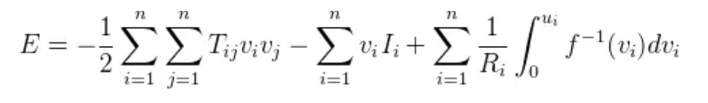

能量函数E是单调下降，故Hopfield网络是稳定的

至此，有了Hopfield网络的CHNN模型的状态方程和能量函数，我们就可以来尝试抽象和转化TSP问题

# CHNN模型下TSP的置换矩阵设计

我们的案例里有8个城市，通过构造NN模型，将每一个城市对应于神经网络的每一个神经元，即案例的TSP问题可以用8x8=64个神经元组成的Hopfield网络来求解

置换矩阵负责翻译并遵从TSP的规则：

1. 一个城市只能被访问一次，翻译为：矩阵每行有且只有一个1，其余元素均为0

2. 一次只能访问一个城市，翻译为：矩阵每列有且只有一个1，其余元素均为0

3. 共访问过n个城市，翻译为：矩阵的全部元素中1的数量为n

# CHNN模型下TSP的能量方程定义

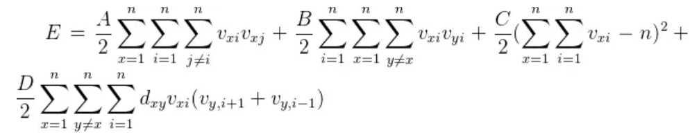

- 第一项:每一行中的每一个城市x，必须有且只有一个1，符合置换矩阵的第一条规则

- 第二项:每一列中的每一个城市x，必须有且只有一个1，符合置换矩阵的第二条规则

- 第三项:整个矩阵有n个1，符合置换矩阵的第三条规则

- 第四项:神经网络输出中有效解的路径长度信息，dxy表示城市x到城市y的距离

- 其中参数ABCD称为权值，前三项是满足TSP置换矩阵的约束条件，最后一项包含优化目标函数项

# CHNN模型下TSP的能量方程和状态方程的优化

由于上式定义的能量函数过于复杂，数学家们对能量函数进行了优化，将TSP问题的能量函数改进为

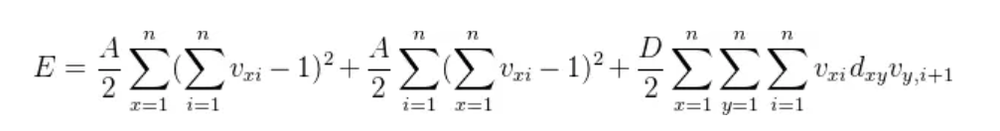

优化后的能量函数减少了权值参数的个数，且根据能量函数E，将CHNN的动态方程优化为

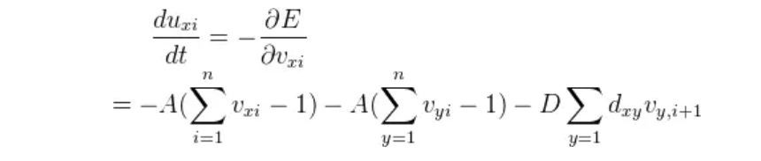

在实际编程中，我们可以用这两个函数优化迭代和判定当前Hopfield神经网络的输出状态

# CHNN模型下TSP输入状态和输出状态的更新方法

根据优化后CHNN的动态方程，可以写出Hopfield递归神经网络的`输入状态`的更新表达式为

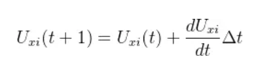

上式中可以看到Hopfield递归神经网络当前时刻的输入与其上一个时刻关联

由非线性映射，我们写出Hopfield递归神经网络的`输出状态`的更新表达式为

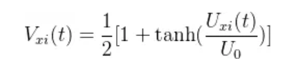

其中输出状态的非线性映射是双曲正切函数

# Hopfield求解TSP问题的步骤

1. 初始化Hopfield神经网络的初值（如输入电压U0、迭代次数）和权值（A、D）

2. 计算n个城市之间的距离矩阵Dxy

3. 初始化神经网络的输入状态

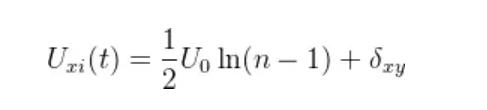

其中加入的随机项为

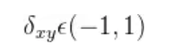

4. 利用CHNN动态方程计算输入状态的增量

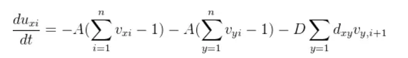

5. 由一阶欧拉方法更新神经网络下一个时刻的输入状态

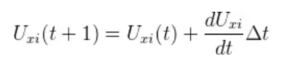

6. 由sigmoid函数更新神经网络下个时刻的输出状态

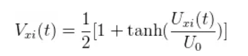

7. 计算当前的能量函数E

8. 检查当前神经网络的输出状态集合，是否满足TSP置换矩阵的规则

# Python编程实现Hopfield TSP

[Hopfield TSP](https://github.com/linzhenyuyuchen)

# 总结

1. Hopfield神经网络是求解TSP的一种优化网络算法

2. Hopfield神经网络通过神经动力学来映射生物神经网络，在参数设置合理的情况下，有可能找到真实最优解，比近似算法计算的效果要好

3. Hopfield神经网络比较依赖初始权值的设置，会受到初始输入状态和输出状态的随机性影响，不一定每一次都可以找到最优解，有可能找到的是不同的次优解
